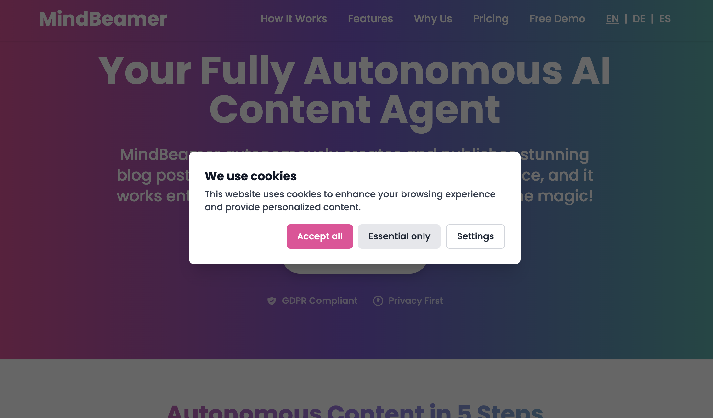
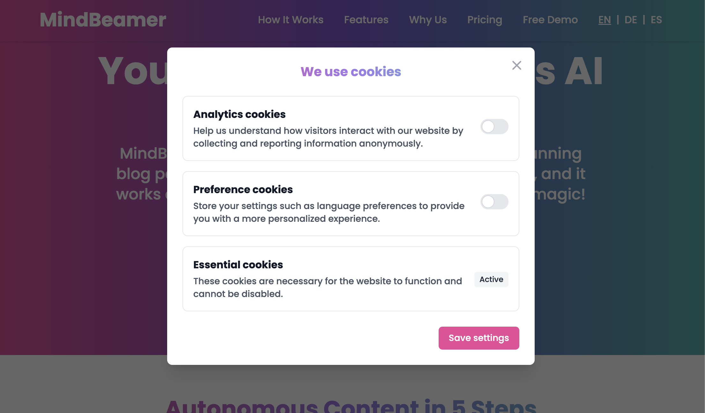
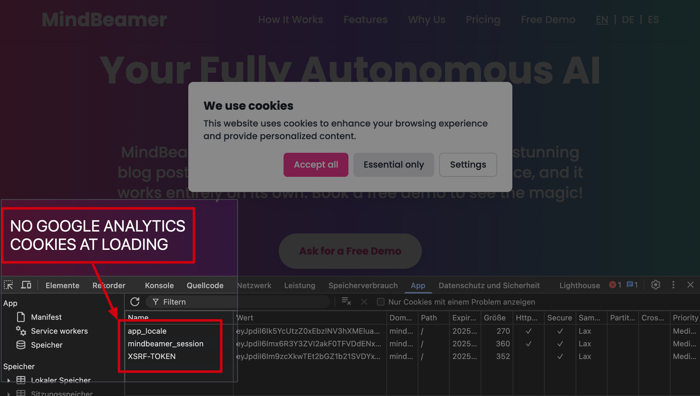

# Laravel Cookie Consent

**A lightweight, GDPR-compliant cookie consent system with minimal dependencies for Laravel 11**

> Perfect for Laravel applications that need a simple, effective, and legally compliant cookie consent solution without the bloat of external JavaScript frameworks.

[](https://laravel.com)
[](LICENSE.md)
[](composer.json)
[](https://gdpr-info.eu/)

## ✨ Highlights

- **Zero external dependencies** - No Livewire, no Filament, no JS frameworks
- **Alpine.js & Vanilla JS** - Uses Alpine.js that comes with Laravel
- **GDPR-compliant** - Legally sound implementation with opt-in for all cookie types
- **Multilingual** - German, English, Spanish and Chinese included
- **Google Analytics Integration** - Dynamic loading and removal of GA scripts
- **Locale Cookie Management** - Stores language preferences only with consent
- **Blade Components** - Easy integration into existing Laravel applications
- **Tailwind CSS** - Elegant, customizable design (optional)
- **Mobile-First** - Fully responsive for all devices

## 📸 Screenshots

### Cookie Consent Banner


### Cookie Settings Modal


### GDPR Compliance: No Analytics Cookies on Load


*Screenshot shows the cookie consent banner with developer tools open, confirming no Google Analytics cookies are loaded before user consent.*

## 🧠 How It Works

This plugin provides a lightweight, GDPR-compliant cookie consent system for Laravel 11 - fully implemented with Blade, Alpine.js, and vanilla JavaScript. It works without Livewire, Inertia, or external dependencies.

### 🇪🇺 GDPR Compliance

The EU General Data Protection Regulation (GDPR) and similar privacy laws worldwide require explicit user consent before storing non-essential cookies. This package implements a fully compliant solution that:

- Blocks all non-essential cookies by default
- Provides clear opt-in choices for different cookie categories
- Allows users to change their preferences at any time
- Properly documents consent for compliance purposes

### 🌐 Google Analytics Integration

- The plugin blocks any connection to Google Analytics by default
- Only when a user explicitly consents to the "Analytics" category, the GA script (gtag.js) is dynamically inserted into the `<head>`
- Website owners only need to enter their Google Tag ID (G-XXXXXXXXXX) - no additional customization required

### 🚫 Tracking Prevention When Declined

- When analytics consent is declined, the GA script is not loaded
- Additionally, the plugin attempts to delete all typical GA cookies, including:
  - _ga, _gid, _gat_*
  - __ga*, __gads
- Even if some cookies cannot be fully deleted for technical reasons (e.g., HttpOnly), no tracking will occur as the JavaScript is not loaded

**Result**: Google has no access to user interactions unless consent is given.

### 🇳🇱 Personal Preferences

The plugin currently stores a single preference: the language setting (locale).
- The language is automatically read from the `<html lang="...">` attribute
- When the user consents to the preferences category, a `locale=xx` cookie is set (e.g., `locale=en`), which Laravel can use for automatic language switching
- If consent is revoked, the locale cookie is deleted

### 🔧 Technical Implementation

| Component | Technology |
|-----------|------------|
| UI / Modals | Blade + Tailwind |
| Logic | Alpine.js (x-data) |
| Consent Storage | localStorage |
| Cookie Handling | JavaScript (document.cookie) |
| Language Detection | document.documentElement.lang |
| GA Activation | document.createElement('script') |
| GA Blocking | No script inclusion + Cookie deletion |

## 🚀 Installation

```bash
composer require martin-schenk/laravel-cookie-consent
php artisan vendor:publish --provider="MartinSchenk\CookieConsent\CookieConsentServiceProvider"
```

## 🔧 Configuration

After publishing the package assets, you can configure the cookie consent system in `config/cookie-consent.php`:

```php
// config/cookie-consent.php
return [
    'google_analytics_id' => env('GOOGLE_ANALYTICS_ID', ''),
    
    'cookie_names' => [
        'consent' => 'cookieConsent',
        'locale' => 'locale',
    ],
    
    'cookie_lifetime' => 31536000, // 1 year in seconds
    
    'categories' => [
        'essential' => true,  // Always required
        'analytics' => false, // Optional
        'preferences' => false, // Optional
    ],
];
```

Add these settings to your `.env` file:

```env
# Cookie Consent Configuration
COOKIE_CONSENT_ENABLED=true

# Google Analytics ID
GOOGLE_ANALYTICS_ID=G-XXXXXXXXXX

# Cookie Settings (optional)
COOKIE_CONSENT_ANALYTICS=false
COOKIE_CONSENT_PREFERENCES=true
COOKIE_CONSENT_COOKIE_LIFETIME=31536000
```

## 📊 Usage

Include the cookie consent component in your main layout file:

```php
<!-- In your layout file -->
<x-cookie-consent::cookie-consent />
```

## 🔗 Adding a Cookie Settings Link to Your Footer

An important feature is the ability to reopen the cookie settings menu at any time. Here are different implementation options:

### Option 1: Direct JavaScript Call

```html
<a href="javascript:void(0);" onclick="window.openCookieSettings()" class="text-gray-400 hover:text-teal-400">
    Cookie Settings
</a>
```

### Option 2: For Complex Layouts (e.g., in a Vue or React component)

```javascript
// Trigger the cookie settings event
document.dispatchEvent(new CustomEvent('open-cookie-settings'));
```

### Option 3: Use as a Blade Component

```php
// In any of your Blade files:
<x-cookie-consent::settings-link class="text-gray-400 hover:text-teal-400" />
```

### Practical Example: Typical Footer Implementation

```php
<!-- Footer with legal links -->
<footer class="bg-gray-800 text-white py-6">
    <div class="container mx-auto">
        <div class="flex flex-wrap justify-center gap-4">
            <a href="{{ route('home') }}" class="text-gray-300 hover:text-white">Home</a>
            <a href="{{ route('imprint') }}" class="text-gray-300 hover:text-white">Imprint</a>
            <a href="{{ route('privacy') }}" class="text-gray-300 hover:text-white">Privacy Policy</a>
            
            <!-- Cookie Settings Link -->
            <a href="javascript:void(0);" 
               onclick="window.openCookieSettings()" 
               class="text-gray-300 hover:text-white">
                Cookie Settings
            </a>
        </div>
    </div>
</footer>
```

## 🌐 Supported Languages

This package comes with translations for:

- English (en)
- German (de)
- Spanish (es)
- Chinese (Simplified) (zh_CN)

You can publish the language files to customize them:

```bash
php artisan vendor:publish --provider="MartinSchenk\CookieConsent\CookieConsentServiceProvider" --tag="cookie-consent-lang"
```

## 🎨 Customizing Appearance

The cookie consent component uses Tailwind CSS by default. You can publish the views to customize the appearance:

```bash
php artisan vendor:publish --provider="MartinSchenk\CookieConsent\CookieConsentServiceProvider" --tag="cookie-consent-views"
```

## 💯 Why Choose This Package?

This plugin is the ideal solution for modern Laravel 11 projects that want to:
- Stay GDPR-compliant ✅
- Maintain maximum control ✅
- Avoid unnecessary external consent tools ✅
- Remain fully customizable and open-source ✅

## 🔍 Keywords

Laravel cookie consent, GDPR cookie banner, Laravel 11 cookie solution, cookie consent manager, Laravel GDPR compliance, cookie opt-in system, Alpine.js cookie consent, privacy cookie banner, EU cookie law Laravel, cookie consent popup, minimal cookie notice, lightweight cookie consent, Laravel cookie management, cookie consent without JavaScript frameworks

## 👥 Contributing

**Contributions are highly welcome and appreciated!**

This project is open for contributions, and we would love for you to help make it better. Whether you want to fix a bug, add a new feature, improve the documentation, or just give feedback, your help is welcome.

Please see [CONTRIBUTING.md](CONTRIBUTING.md) for detailed guidelines on how to contribute to this project.

### 🌱 Good First Issues

Looking for something to work on? Issues labeled with [`good first issue`](https://github.com/martin-schenk/laravel-cookie-consent/labels/good%20first%20issue) are a great way to start contributing.

### 🗺️ Roadmap

We're planning to add the following features in future releases:

- Support for additional cookie categories
- More styling options and themes
- Additional analytics services integration
- Cookie expiration management
- Support for older Laravel versions

Feel free to pick up any of these tasks or suggest new ones!

## 📝 License

The MIT License (MIT). Please see [License File](LICENSE.md) for more information.
